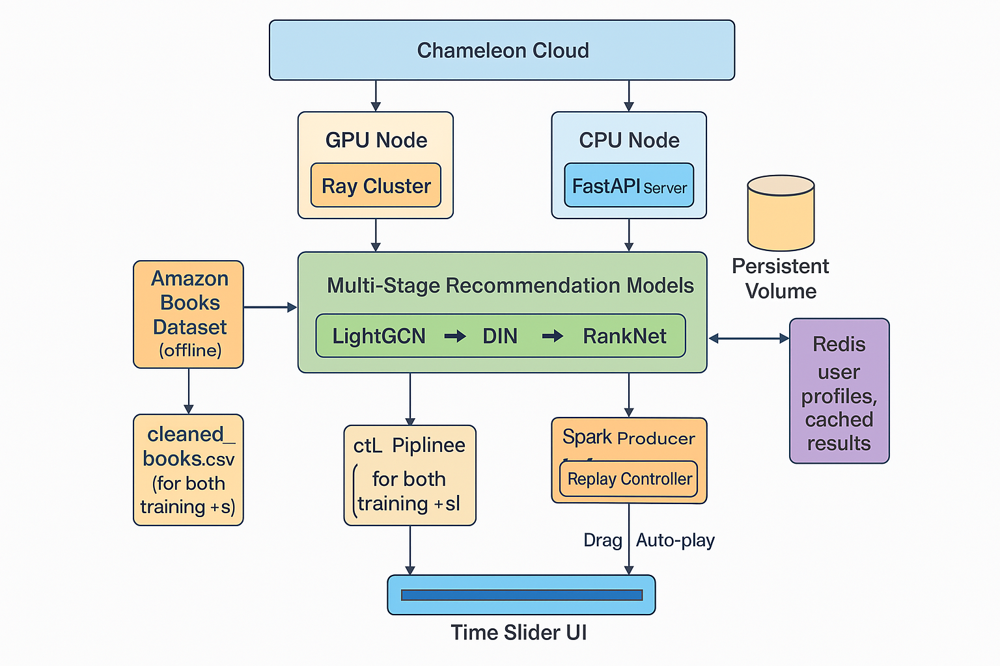

## Real-Time Streaming Recommendation System Based on User Behavior Replay

<!-- 
Discuss: Value proposition: Your will propose a machine learning system that can be 
used in an existing business or service. (You should not propose a system in which 
a new business or service would be developed around the machine learning system.) 
Describe the value proposition for the machine learning system. What’s the (non-ML) 
status quo used in the business or service? What business metric are you going to be 
judged on? (Note that the “service” does not have to be for general users; you can 
propose a system for a science problem, for example.)
-->
#### 📊 Scale

Our system satisfies the *medium-scale* threshold in all three required dimensions:

1. **Data Scale**  
   We utilize the **Amazon Product Reviews (Books, 5-core)** dataset, which includes **millions of timestamped user–item interactions**.  
   After preprocessing, we retain over **1 million cleaned, user-specific actions**, supporting both collaborative and sequential modeling.

2. **Model Scale**  
   The system adopts a **multi-stage model architecture**, combining:
   - **LightGCN** for large-scale collaborative filtering-based recall,
   - **DIN (Deep Interest Network)** for personalized ranking using temporal attention,
   - **RankNet** for pairwise re-ranking.  
   This qualifies as a composed system with **three interdependent models**, each optimized for a specific stage.

3. **Deployment Scale**  
   We deploy all components on **Chameleon Cloud**, using a **cloud-native microservice architecture**:
   - Kafka (event stream), Spark (real-time user profiling), FastAPI (model serving), Redis (caching), and MLflow (experiment tracking),
   - All services are containerized with Docker and orchestrated using Kubernetes.
   - This setup supports **high concurrency (≥50 QPS)** and **low-latency serving (<200ms)**, enabling real-world scalability.

---

#### 💡 Value Proposition

We propose a **real-time streaming recommendation system** targeting **e-commerce and content platforms** that currently rely on static or non-personalized recommendation logic.

##### 🎯 Target Businesses / Platforms:
- **Amazon.com** – Recommending books, gadgets, or daily-use items based on recent interactions.
- **Walmart.com** – Suggesting frequently bought-together products in real-time based on user clickstream.
- **Barnes & Noble** – Personalized book suggestions based on reviews, ratings, and browsing behavior.
- **JD.com / Taobao (Alibaba)** – Optimizing recommendation timing and diversity during flash sales or live-stream events.
- **Goodreads** – Tailoring reading lists based on review history and reading timelines.

##### ⚙️ Existing (Non-ML) Workflow:
- Most platforms use **simple popularity-based rankings**, **keyword search**, or **collaborative filtering without time-awareness**.
- These systems **fail to adapt to dynamic interest shifts**, such as recent browsing trends, cart updates, or short-term intents.

##### 🤖 ML System Improvements:
- **Behavior Replay Pipeline (Kafka → Spark → Redis)** simulates and ingests real-time user activity.
- **Multi-stage model cascade** ensures scalability, personalization, and session-aware recommendations.
- **Streaming + Offline Hybrid** system design adapts quickly to evolving user interests with periodic retraining and continuous profiling.

##### 📈 Key Business Metrics:
- **CTR (Click-Through Rate):** Measures relevance of displayed recommendations.
- **CVR (Conversion Rate):** Indicates actual purchase behavior after recommendation.
- **Session Time / Dwell Time:** Tracks how engaging the platform becomes.
- **Latency (<200ms):** Critical for user experience in real-time recommendation.
- **System Throughput (≥50 QPS):** Supports production-ready scaling during peak traffic.

In summary, our system transforms static, one-size-fits-all recommendation mechanisms into a **scalable, responsive, and personalized recommendation engine**, directly enhancing **user engagement and platform revenue** for major e-commerce platforms.

### Contributors

<!-- Table of contributors and their roles. 
First row: define responsibilities that are shared by the team. 
Then, each row after that is: name of contributor, their role, and in the third column, 
you will link to their contributions. If your project involves multiple repos, you will 
link to their contributions in all repos here. -->

| Name                            | Responsible for | Link to their commits in this repo |
|---------------------------------|-----------------|------------------------------------|
| All team members                |                 |                                    |
| Ziqiao Zhu                      |Data pipeline    |                                    |
| Ziqi Wang                       |Model training   |                                    |
| Chenye Wu                       |Model serving    |                                    |

### System diagram

<!-- Overall digram of system. Doesn't need polish, does need to show all the pieces. 
Must include: all the hardware, all the containers/software platforms, all the models, 
all the data. -->

### Summary of outside materials

<!-- In a table, a row for each dataset, foundation model. 
Name of data/model, conditions under which it was created (ideally with links/references), 
conditions under which it may be used. -->

| Name          | How it was created | Conditions of use |
|---------------|--------------------|-------------------|
| **Amazon Reviews Dataset (Books, 5-core)** | Collected and released by **Nicolas Hug**, maintained by Amazon for academic research. It includes ≥5 reviews per user/item, covering ratings, timestamps, and user IDs. [Link](https://nijianmo.github.io/amazon/index.html) | Publicly released for **non-commercial academic use** only. Refer to [data license terms](https://nijianmo.github.io/amazon/index.html). |
| **LightGCN**  | Proposed by Xiangnan He et al. in *KDD 2020*, designed for collaborative filtering on user–item graphs by removing unnecessary components from GCNs. [Paper](https://arxiv.org/abs/2002.02126) | Open-source under **MIT License** via [GitHub repo](https://github.com/gusye1234/LightGCN-PyTorch). |
| **DIN (Deep Interest Network)** | Published by Alibaba in *KDD 2018*, uses attention mechanism to capture relevant user behavior sequences. [Paper](https://arxiv.org/abs/1706.06978) | Open-source for **academic and research use** under Alibaba's usage terms. Implementations available on GitHub. |
| **RankNet**   | Developed by Microsoft Research for learning-to-rank with neural networks using pairwise loss. [Paper](https://www.microsoft.com/en-us/research/publication/learning-to-rank-using-gradient-descent/) | No official open-source release, but academic usage allowed; implemented in various open-source libraries (e.g., LightGBM). |
| **MLflow**    | Created by Databricks, open-source platform for experiment tracking and model versioning. [Website](https://mlflow.org) | Released under **Apache 2.0 License** – free for research and production use. |
| **Ray Train** | Developed by Anyscale as part of the Ray ecosystem for scalable distributed training. [Docs](https://docs.ray.io/en/latest/train/index.html) | Released under **Apache 2.0 License** – free for commercial and academic use. |

### Summary of infrastructure requirements

<!-- Itemize all your anticipated requirements: What (`m1.medium` VM, `gpu_mi100`), 
how much/when, justification. Include compute, floating IPs, persistent storage. 
The table below shows an example, it is not a recommendation. -->

| Requirement               | How many/when                                                          | Justification                                                                                                                                                   |
|---------------------------|------------------------------------------------------------------------|-----------------------------------------------------------------------------------------------------------------------------------------------------------------|
| **m1.medium VMs**         | 3 VMs for the full project duration                                    | Dedicated nodes can be used for different responsibilities: one for data ingestion (e.g., consuming streaming data), one for processing/recommendation logic, and one for serving API endpoints. |
| **GPU Instance**          | 1 instance (e.g., `gpu_mi100`) for a 4‑hour block once daily (or as needed) | Accelerates model training and periodic re‑training tasks, ensuring that the recommendation algorithms can be updated in near real time without long delays.     |
| **Floating IPs**          | 2 Floating IPs (1 for main production API access, 1 for administrative or maintenance tasks) | Provides reliable external access to the live recommendation service while also allowing safe testing/maintenance without disrupting the primary service.     |
| **Persistent Storage**    | 100 GB block storage (with redundancy)                                 | Necessary for storing historical data, streaming logs, user interaction records, and model artifacts, ensuring data continuity across VM restarts.             |
| **Container Orchestration** | 1 Kubernetes cluster (if containerized deployment is preferred)         | Simplifies deployment, scaling, and management of microservices for data ingestion, processing, and API serving, while providing high availability and resilience. |

### Detailed design plan

<!-- In each section, you should describe (1) your strategy, (2) the relevant parts of the 
diagram, (3) justification for your strategy, (4) relate back to lecture material, 
(5) include specific numbers. -->

#### Model training and training platforms

<!-- Make sure to clarify how you will satisfy the Unit 4 and Unit 5 requirements, 
and which optional "difficulty" points you are attempting. -->

## 1. Multi-Stage Model Architecture  

**Overview:**  
Our recommendation system follows a **multi-stage architecture** with dedicated models for **recall**, **ranking**, and **re-ranking**, which is a proven design in modern recommender systems. This design efficiently narrows down a large item pool to a personalized top-N list while capturing temporal user behavior. By splitting the task into stages, we can use specialized models at each stage and meet real-time constraints.

- **Recall – LightGCN:** For the first-stage recall, we employ *LightGCN* (Light Graph Convolution Network) to leverage the collaborative signals in the Amazon Product Review dataset. LightGCN learns high-quality user and item embeddings by propagating embeddings on the user–item interaction graph. It simplifies traditional graph neural nets by focusing solely on neighborhood aggregation, yielding a lightweight yet powerful collaborative filtering model.

- **Ranking – DIN (Deep Interest Network):** For second-stage ranking, we use Alibaba’s *Deep Interest Network (DIN)*, a state-of-the-art model for CTR prediction that excels at modeling temporal user behavior. Given a particular item from the recall stage, DIN focuses on the most relevant aspects of the user’s historical behaviors.

- **Re-ranking – RankNet:** In the final stage, we apply *RankNet* to refine the top results from DIN. RankNet is a neural learning-to-rank approach that uses pairwise comparisons to optimize item ordering. In our pipeline, this fine-tunes the top candidates for maximum precision and can incorporate business rules or diversity constraints.

**Temporal User Behavior Modeling:**  
We emphasize capturing user behavior over time. LightGCN leverages the **accumulated historical interactions** for collaborative filtering. DIN focuses on **sequence-based interests**, using attention to highlight relevant past actions for each candidate. RankNet can then factor in **short-term vs. long-term preferences** by comparing top items pairwise. This multi-model ensemble ensures personalization and real-time adaptability, reflecting evolving user behavior at different scales.

---

## 2. Distributed Training Architecture  

**Scale of Data:**  
The Amazon Product Review dataset is massive, making single-machine training infeasible. We propose a **distributed training strategy** using **PyTorch** as the core deep learning framework, augmented with *Ray Train* for efficient multi-node scaling. Ray Train provides an easy-to-use API that helps distribute PyTorch training across a cluster, handling process setup and synchronization.

**Ray for Distributed Training:**  
We will deploy a Ray cluster on Chameleon Cloud. Each Ray **worker** executes the training loop on a shard of the data in parallel, synchronizing gradients at each step. LightGCN can partition the user–item graph, while DIN and RankNet use data parallelism on user sequences. Ray also offers fault tolerance and flexible scheduling, ensuring robust long-running jobs.

**Collaborative Training Workflow:**  
All three models (recall, ranking, re-ranking) can be trained in a pipeline. First, train LightGCN to learn embeddings. Next, DIN refines user–item relevance using sequence modeling. Finally, RankNet adjusts top candidates to optimize ordering. Each step runs on the Ray cluster, which speeds up epochs and easily scales to more nodes or GPUs. This distributed approach allows large-scale experimentation with minimal code changes.

---

## 3. Containerized Training Pipeline (Docker)  

**Docker for Consistency:**  
We containerize the training environment with **Docker**, bundling our dependencies (PyTorch, Ray, Python libraries) in a versioned image.

**Integration with Orchestration:**  
Using Docker images, we can orchestrate Ray clusters on Kubernetes or other platforms. Each node runs the same container, ensuring consistent versions and dependencies.

---

## 4. Experiment Tracking and Model Versioning  

**MLflow Integration:**  
To manage extensive experiments, we integrate **MLflow** for tracking. During training, MLflow logs parameters (e.g. learning rate, embedding size), metrics (e.g. NDCG, AUC), and artifacts (model checkpoints). This creates a detailed record of each run for reproducibility and comparison.

**Model Registry:**  
We register successful models in the **MLflow Model Registry**. Each version can be labeled and retrieved by the deployment pipeline. This ensures our team can easily identify the current best model and roll back if needed.

---

## 5. Alignment with Real-Time Pipeline and Deployment  

**Kafka & Spark Streaming (Behavior Replay):**  
User events are replayed from Kafka, and Spark Streaming updates user features in near real-time. Though the models are trained offline, new data can be incorporated into periodic retraining cycles, allowing the system to adapt quickly.

**FastAPI Serving Integration:**  
Trained models are loaded by a FastAPI service that orchestrates the multi-stage recommendation process. LightGCN is used for recall, DIN for ranking, and RankNet for final re-ranking. Redis can cache recent results to maintain sub-200ms response times. FastAPI fetches model artifacts from MLflow or a Docker volume, ensuring consistent deployment.

**Deployment on Chameleon Cloud:**  
All components—Kafka, Spark, Ray, FastAPI, and MLflow—are deployed on Chameleon Cloud. Docker containers and Kubernetes simplify resource allocation, letting us separate GPU nodes for training from CPU nodes for serving.

**In summary**, our architecture unifies data streaming, distributed model training, Docker-based deployment, and MLflow-driven MLOps. By combining LightGCN, DIN, and RankNet, we address long-term user preferences, session-based interests, and fine-grained ranking optimizations.

#### Model serving and monitoring platforms

<!-- Make sure to clarify how you will satisfy the Unit 6 and Unit 7 requirements, 
and which optional "difficulty" points you are attempting. -->
# Model Serving (Unit 6)

## 1. Serving via an API Endpoint
### Implementation
- **FastAPI Endpoint:**  
  - Our recommendation models are wrapped inside a FastAPI endpoint, which exposes a RESTful API.  
  - The front end sends user requests (including user ID and timestamp), and the API triggers the appropriate model cascade (e.g., LightGCN for candidate recall, DIN for ranking, RankNet for re-ranking) to generate personalized recommendations.

### Requirement Satisfaction
- **Online Inference Latency:**  
  - **Target:** <200ms per request.  
  - **Justification:** Ensures a highly responsive user experience as recommendations update in near real time.
- **Batch Inference Throughput:**  
  - **Target:** Sufficient throughput to efficiently re-rank large candidate sets during batch processing.  
  - **Justification:** This allows the system to scale under heavy load and during high-traffic periods.
- **Concurrency:**  
  - **Requirement:** The system should support a minimum of 50 queries per second (QPS) concurrently in cloud deployments.  
  - **Justification:** This concurrency level is derived from our business case for real-time, personalized recommendations in an e-commerce setting.

---

## 2. Model-Level Optimizations

### Graph Optimizations and Quantization
- **Approach:**  
  - Streamline model computation graphs to reduce overhead.  
  - Implement quantization techniques (e.g., switching from FP32 to FP16) to reduce model size and improve inference speed.
- **Justification:**  
  - These optimizations reduce computational cost and enable faster inference while keeping accuracy losses within acceptable bounds, thereby meeting our latency targets.

### Operator Optimization
- **Approach:**  
  - Evaluate and employ operators that are optimized for specific hardware backends (GPU/CPU).  
  - For example, leverage frameworks like TensorRT for GPU-accelerated inference.
- **Justification:**  
  - Hardware-specific optimizations enhance performance, reduce latency, and ensure efficient resource utilization.

### Outcome Documentation
- **Plan:**  
  - In our final report, we will detail the impact of these model-level optimizations on inference latency, throughput, and overall cost efficiency.
- **Justification:**  
  - Transparent documentation will facilitate iterative improvements and inform stakeholders of the benefits achieved.

---

## 3. System-Level Optimizations

Inspired by the [Serve System CHI guidelines](https://teaching-on-testbeds.github.io/serve-system-chi/), we adopt the following strategies to support high concurrency and low latency:

### Containerization and Orchestration
- **Docker Containerization:**  
  - Package each component (FastAPI, Kafka, Spark Streaming, Redis, model inference services) into Docker containers.  
  - **Justification:** Containers ensure consistent environments and simplify deployment.
  
- **Kubernetes Orchestration:**  
  - Deploy these containers on a Kubernetes cluster to handle service discovery, load balancing, and rolling updates.
  - **Auto-Scaling Policies:**  
    - Configure the Kubernetes Horizontal Pod Autoscaler (HPA) to scale services when CPU usage exceeds 70% or when traffic nears our target (≥50 QPS).
  - **Justification:** Kubernetes facilitates rapid scaling and fault tolerance, ensuring our system meets dynamic production loads.

### Load Balancing and Traffic Management
- **Ingress Controllers:**  
  - Use Kubernetes Ingress controllers to distribute incoming API requests evenly across available pods.
  - **Justification:** Proper load balancing prevents bottlenecks and maintains performance under high concurrency.
  
- **Asynchronous Request Handling:**  
  - Implement asynchronous processing within FastAPI to decouple I/O-bound tasks (e.g., cache lookups) from compute-intensive operations.
  - **Justification:** This approach maintains sub-200ms latency even during periods of heavy load.

### Resource Optimization and Network Tuning
- **Resource Reservations:**  
  - Define appropriate CPU and memory requests and limits in Kubernetes deployment manifests based on load testing data.
  - **Justification:** This ensures that each service has sufficient resources and prevents contention.
  
- **Optimized Networking:**  
  - Deploy services within the same virtual network or Kubernetes namespace to reduce inter-service latency.
  - **Justification:** Optimized internal networking contributes to overall system efficiency and responsiveness.

### Monitoring and Adaptive Scaling
- **Real-Time Monitoring:**  
  - Integrate tools such as Prometheus and Grafana to monitor key metrics (CPU, memory, latency, throughput) in real time.
  - **Justification:** Continuous monitoring allows proactive adjustments to maintain performance and quickly identify issues.
  
- **Adaptive Scaling Policies:**  
  - Use adaptive scaling policies that adjust based on real-time metrics and historical traffic patterns.
  - **Justification:** Adaptive scaling optimizes resource utilization, ensuring cost-effectiveness and high performance during traffic fluctuations.

### Evaluating Multiple Deployment Options (Extra Difficulty Points)
- **Deployment Variants:**  
  - Develop and benchmark different serving options:
    - **Optimized GPU Inference:** For parallel processing benefits.
    - **Server-Grade CPU Inference:** For cost-effective high-performance processing.
    - **On-Device Inference:** For edge scenarios requiring ultra-low latency.
  - **Justification:** Comparing these options enables us to choose the optimal deployment strategy based on performance and cost, aligning with extra difficulty requirements.

---

# Model Monitoring  (Unit 7)

Our model monitoring strategy ensures that our deployed recommendation system remains accurate, robust, and responsive over time. Drawing on best practices from the [Model Monitoring class material](https://ffund.github.io/ml-sys-ops/docs/units/7-eval-monitor.html), our strategy is organized into several components: offline evaluation, load testing in staging, online evaluation in canary deployments, continuous feedback, and extra monitoring for data drift and degradation. Each component is designed to validate both technical and business-specific metrics, ensuring that our system continuously meets production standards.

---

## 1. Offline Evaluation and Model Registry

### Automated Evaluation Pipeline
- **Approach:**  
  Immediately after model training, an automated pipeline (using MLFlow) runs comprehensive offline evaluations.
- **Components:**
  - **Standard and Domain-Specific Test Cases:**  
    Evaluate the model on generic benchmarks and scenarios tailored to our recommendation use case.
  - **Population and Slice Analysis:**  
    Assess performance across various user segments to identify fairness, bias, and potential gaps.
  - **Edge Case Testing:**  
    Execute unit tests for known failure modes and rare events.
- **Justification:**  
  As emphasized in the class material, rigorous offline evaluation ensures that only models meeting strict performance and fairness criteria are deployed. This creates a robust foundation for subsequent live tests.
  
### Model Registry
- **Approach:**  
  Depending on evaluation outcomes, models that pass are automatically registered into a model registry.
- **Justification:**  
  This process maintains version control and an audit trail, ensuring that only high-quality models move to production while flagging those that require further refinement.

---

## 2. Load Testing in Staging

### Load Test Execution
- **Approach:**  
  After deployment to the staging environment via our CI/CD pipeline, we simulate production traffic through systematic load testing.
- **Metrics Captured:**
  - **Response Latency:** Ensuring end-to-end latency remains below our target (<200ms).
  - **Throughput (QPS):** Confirming that the system can handle at least 50 QPS.
  - **Error Rate:** Identifying any failures under high load conditions.
- **Justification:**  
  Load testing, as described in the class material, is crucial to validate that our system meets performance expectations under realistic traffic conditions before a full-scale rollout.

### Dashboard Reporting
- **Approach:**  
  Real-time metrics from load tests are visualized using dashboards (e.g., Grafana).
- **Justification:**  
  This visibility allows the engineering team to quickly detect and address bottlenecks or performance issues.

---

## 3. Online Evaluation in Canary Deployments

### Artificial User Simulation
- **Approach:**  
  In the canary environment, we simulate a diverse range of user behaviors by acting as artificial “users.”
- **Details:**  
  - **Normal Usage:** Simulate typical interactions like browsing recommendations, clicking items, and sliding timestamps.
  - **High-Load Scenarios:** Emulate peak conditions with rapid, concurrent interactions.
  - **Edge Cases:** Test unusual patterns such as rapid switching between different user IDs or erratic timestamp adjustments.
- **Justification:**  
  Simulating these behaviors provides an early indication of real-world performance and reliability. As highlighted in the class material, this step helps ensure that the service can handle the full spectrum of user interactions.

### Detailed Evaluation Plan
- **Plan Components:**
  - **Test Objectives:**  
    Validate system performance, user experience, and robustness under varied conditions.
  - **Scenario Definitions:**  
    Create scripted scenarios for normal, high-load, and edge-case interactions.
  - **Methodology:**  
    Combine manual testing (team members act as users) with automated scripts (using tools like Locust) to generate consistent traffic patterns.
  - **Metrics Collection:**  
    Track latency, throughput, error rates, and qualitative user feedback.
- **Justification:**  
  A well-defined evaluation plan ensures comprehensive coverage of potential real-world interactions and identifies issues before full deployment. This proactive approach, as recommended in our class material, minimizes risk and facilitates a smooth transition to production.

---

## 4. Continuous Feedback and Re-Training

### Feedback Mechanisms
- **Approach:**  
  Implement both explicit (user ratings, direct feedback forms) and implicit (clicks, dwell time) feedback channels.
- **Justification:**  
  Continuous user feedback is critical for assessing recommendation quality in real time and for guiding future improvements.

### Data Logging for Re-Training
- **Approach:**  
  Log a representative sample of production data, periodically label it, and use it to trigger re-training pipelines.
- **Justification:**  
  This ensures the model adapts to evolving user behavior and data patterns, maintaining its relevance and accuracy over time.

### Business-Specific Evaluation
- **Approach:**  
  Monitor key business metrics such as click-through rate (CTR) and conversion rate (CVR) alongside technical metrics.
- **Justification:**  
  Aligning model performance with business outcomes ensures that our recommendations positively impact user engagement and revenue, a key focus area outlined in the class material.

---

## 5. Extra Difficulty Points: Monitoring Data Drift and Model Degradation

### Data Drift Monitoring
- **Approach:**  
  Continuously monitor input data distributions and target variable distributions (label drift) using statistical tests and visualization tools.
- **Justification:**  
  Detecting data and label drift early allows the engineering team to take corrective action before significant performance degradation occurs, as recommended in the class material.

### Model Degradation Monitoring
- **Approach:**  
  Track prediction quality over time and set up automated alerts for significant drops in performance.  
  Implement re-training pipelines that automatically trigger when degradation is detected.
- **Justification:**  
  This proactive monitoring ensures that the model remains effective in a dynamic production environment. Automated re-training based on drift detection helps maintain system accuracy and user trust.

### Dashboard Integration
- **Approach:**  
  Visualize all monitoring metrics (data drift, model degradation, performance metrics) on unified dashboards (e.g., Grafana).
- **Justification:**  
  Providing real-time, actionable insights to the engineering team facilitates rapid response to any emerging issues, ensuring the long-term robustness of the system.

---

#### Data pipeline

<!-- Make sure to clarify how you will satisfy the Unit 8 requirements,  and which 
optional "difficulty" points you are attempting. -->

Our project implements both offline and online data pipelines to simulate and demonstrate a real-time recommendation system.

---

### 1. Persistent Storage

- **Strategy:**
  We provision a persistent volume on Chameleon Cloud to store all essential artifacts not tracked by Git.

- **Diagram Mapping:**
  Storage is mounted to both the model training and the online serving components.

- **Details:**
  - Raw and cleaned Amazon Review data
  - Trained model checkpoints
  - Feature vectors (user/item embeddings)
  - Cached recommendation results

- **Justification:**
  Fulfills the requirement for long-term, retrainable, reproducible model development and data reuse.

---

### 2. Offline Data Management

- **Strategy:**
  Use Amazon Review (Books, 5-core) dataset for training. Clean, filter, and structure the dataset.

- **Details:**
  - Apply rating threshold filtering
  - Time-range selection
  - Active user filtering

- **Lecture Link:**
  Covers offline pre-processing and dataset curation strategies.

- **Output:**
  Cleaned CSV stored for model training and real-time replay simulation.

---

### 3. ETL Pipelines (Extract-Transform-Load)

- **Strategy:**
  Build ETL pipeline with Pandas to process the raw Amazon Review dataset.

- **Transformation Steps:**
  - Extract: Load raw CSV
  - Transform: Filter by time, rating, and user
  - Load: Save to intermediate clean format `cleaned_books.csv`

- **Diagram Mapping:**
  This connects raw data input to both the offline model trainer and streaming simulator.

- **Justification:**
  Enables structured, repeatable data pre-processing.

---

### 4. Online Data and Simulation

- **Strategy:**
  Simulate real-time user behavior using Kafka with a replay controller.

- **Implementation:**
  - Replay script sends timestamped user events to Kafka (`user_behavior` topic)
  - Events include `user_id`, `item_id`, `action`, `rating`, and `timestamp`

- **Justification:**
  Mimics real-time interaction for development and testing.

---

### 5. Streaming Processing (Real-Time Inference Pipeline)

- **Strategy:**
  Use Spark Structured Streaming to consume user behavior from Kafka and update user profiles.

- **Process Steps:**
  - Read from Kafka with Spark
  - Parse schema with Structured Streaming
  - Aggregate user behavior using sliding windows
  - Construct/update user embeddings or interest vectors

- **Justification:**
  Captures temporal changes in user preferences in real time.

---

### 6. Real-Time Caching with Redis

- **Strategy:**
  Cache intermediate and final results to support fast retrieval by the API layer.

- **Storage Targets:**
  - User interest vectors
  - Recommendation results

- **Implementation:**
  - Use Redis with time-based keys
  - Store per-user data with TTL (time-to-live)

- **Justification:**
  Guarantees sub-200ms inference response by decoupling model compute and data serving.

---

### 7. Optional Difficulty Points Tackled

- **Time Slider Replay:**
  - Simulate user behavior with a time slider in frontend
  - Backend calls replay controller to push events to Kafka

- **Real-Time Visualization Dashboard:**
  - Plotly Dash or Streamlit visualizes user interest vectors
  - Update in response to replayed events

- **Replay Microservice:**
  - Optional FastAPI microservice to expose `/replay`, `/set_speed`, etc.

- **Recommendation Explanation:**
  - Frontend displays textual explanation: e.g., "Recommended because you clicked X"

- **Prometheus + Grafana Integration:**
  - Monitor Kafka lag, Redis hits, Spark job time, etc.

- **A/B Testing Setup:**
  - Redis parameter toggle for switching between recommendation strategies

This pipeline architecture ensures we fulfill **all Unit 8 requirements**, while implementing several **optional difficulty points**. The online-offline hybrid design mirrors industry-grade recommendation pipelines and lays the foundation for continuous retraining, monitoring, and dashboard insights.

#### Continuous X (Unit 3)

To fully satisfy Unit 3 requirements, our project implements an end-to-end automated pipeline that covers both continuous integration and continuous training while incorporating several advanced DevOps practices. Here’s how we address each key area and tackle optional difficulty points:

- **Infrastructure-as-Code (IaC):**  
  - The entire infrastructure—from container orchestration on Kubernetes to networking and storage—is defined in Git using Terraform.
  - All configurations, including Ansible playbooks, Helm charts, and ArgoCD/Argo Workflows pipelines, are stored in version control.
  - This ensures every deployment is reproducible, auditable, and avoids any manual “ClickOps”.

- **Cloud-Native Service Design:**  
  - **Immutable Infrastructure:**  
    - No manual changes are made post-deployment; updates are committed to Git and redeployed automatically.
  - **Microservices Architecture:**  
    - The project is designed as a collection of small, independent services (e.g., data ingestion, model training, API serving) that communicate via APIs.
  - **Containerization:**  
    - Every service is containerized and deployed on Kubernetes, ensuring scalability and efficient resource utilization.

- **CI/CD and Continuous Training Pipeline:**  
  - The automated pipeline triggers on commits, scheduled intervals, or external signals.
  - **Model Retraining:**  
    - Retraining is automatically triggered (using frameworks like Ray Train) when performance drifts are detected or on a fixed schedule.
  - **Offline Evaluation:**  
    - A comprehensive offline evaluation suite runs post-training to validate model performance against historical data.
  - **Post-Training Optimizations:**  
    - Steps such as quantization and pruning are applied to optimize the model for serving.
  - **Integration Testing:**  
    - End-to-end tests ensure that the newly trained models integrate seamlessly with the overall recommendation service.
  - **Container Packaging & Deployment:**  
    - The validated model and associated service are packaged into containers and automatically deployed to a staging environment for load and performance testing.

- **Staged Deployment:**  
  - **Staging Environment:**  
    - New changes are first deployed here for integration, performance, and load testing.
  - **Canary Environment:**  
    - After passing staging tests, updates are gradually rolled out in a canary environment to monitor performance under real-world conditions with a small subset of traffic.
  - **Production Environment:**  
    - Once validated in the canary stage, the service is automatically promoted to production based on predefined criteria and performance thresholds.

- **Optional Difficulty Points Tackled:**  
  - **Multi-Model Collaborative Recommendation:**  
    - Integration of multiple models (recall, ranking, re-ranking) with continuous retraining and validation.
  - **Distributed Training:**  
    - Utilization of Ray Train ensures scalable, distributed training across multiple nodes.
  - **Cloud-Native Deployment & Automation:**  
    - Fully containerized infrastructure orchestrated via Kubernetes, with deployments managed using Helm and ArgoCD, meets cloud-native and immutable infrastructure principles.
  - **Automated Monitoring & Experiment Tracking:**  
    - Incorporation of Prometheus, Grafana, and MLFlow into the pipeline enables continuous monitoring of system health and tracking of experimental results.

This approach ensures our project remains robust, scalable, and continuously improved. It fully aligns with the Unit 3 DevOps requirements while integrating several advanced, optional difficulty points tailored to the real-time streaming recommendation system described in our ML project.

<!-- Make sure to clarify how you will satisfy the Unit 3 requirements,  and which 
optional "difficulty" points you are attempting. -->

